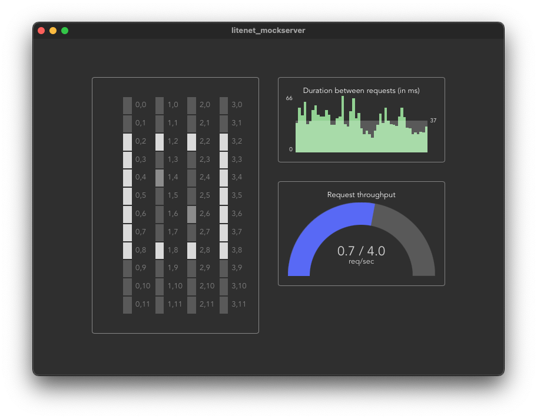

# litenet_mockserver

This is a mockserver for the Litenet-controller CLI. It provides a local webserver to which the requests of
the Litenet-controller can be sent to. The state of the luminaires (on / off / dimmed) are reflected in the
GUI.



## Requirements

-   Node.js >= 16
-   Rust >= 1.62

## Run the server

This is a [Tauri](https://tauri.app/) app. To run the server in dev-mode, run following command:

```sh
npm run tauri dev
```

The webserver listens to the port `8000` by default.

## Technologies used

-   Tauri (with Svelte, Vite and Rust)

## Motivations

-   Create a mockserver to make testing the Litenet-controller CLI easier
-   Practice Rust
-   Try Tauri

## Recommended IDE Setup

[VS Code](https://code.visualstudio.com/) + [Svelte](https://marketplace.visualstudio.com/items?itemName=svelte.svelte-vscode) + [Tauri](https://marketplace.visualstudio.com/items?itemName=tauri-apps.tauri-vscode) + [rust-analyzer](https://marketplace.visualstudio.com/items?itemName=rust-lang.rust-analyzer).
